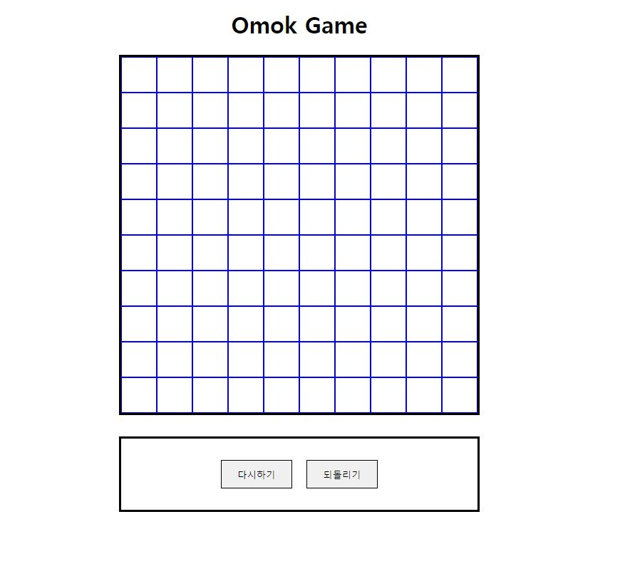
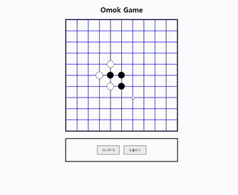

# 오목(Omok)
두명의 플레이가 서로 번갈아 돌을 두어 먼저 5개의 돌을 한줄로 연결시키는 사람이 이기는 게임입니다.


Homepage view
-------------

 <p align="center"></p>
이 홈페이지는 React를 이용하여 제작하였습니다.
<br>


Function introduction
----------------

- 돌 놓기  
화면의 바둑판에 파란선이 교차하는 지점을 클릭하면 돌이 생성된다.  
돌은 검은 돌, 흰 돌 순으로 한 번씩 생성된다.

- 다시하기 버튼  
다시하기 버튼을 누르면 게임을 처음부터 다시할 수 있다.

- 되돌리기 버튼  
되돌리기 버튼을 누르면 마지막으로 놓은돌 하나를 무를 수 있다. 

- 게임종료  
흑돌 또는 백돌 중 한명이 5개의 돌을 먼저 연결하면 게임이 종료되고 승리자가 결정된다.


Play example
------------

  <p align="center"></p>

React
----------
리액트를 통해 처음으로 만든 웹으로 초기에 리액트의 개념을 이해하는데 어려움이 있었다.  
리액트 DOM을 직접 컨트롤 하는 것이 아니라 가상 DOM의 개념과 컴포넌트 기반의 구조를 사용하여  
데이터의 변경이 있을때 기존과 비교해 변경된 부분을 새롭게 랜더링하는 방식을 사용한다.

 - useState  
 useState로 설정한 변수를 set함수를 통해 변경하면 관련된 컴포넌트를 새롭게 랜더링한다.
```js
function App() {
  const [stoneBLocation, setStoneBLocation] = useState([])
  const [stoneWLocation, setStoneWLocation] = useState([])

  return (
      <Board stoneBLocation = {[stoneBLocation, setStoneBLocation]} stoneWLocation = {[stoneWLocation, setStoneWLocation]}/>
  );
}
```
부모 컴포넌트에서 생성한 state변수를 props를 통해 자식컴포넌트에 넘겨주고  
자식컴포넌트에서 props를 받아 state 변수를 활용할 수 있다.
```js
function Board(props){
    function onClickBoardButton(i){
        if(props.turnCount[0]%2 === 0){
            props.stoneBLocation[1](stoneBLocation => [...stoneBLocation, i])
        }
        else{
            props.stoneWLocation[1](stoneWLocation => [...stoneWLocation,i])
        }
        props.turnCount[1](props.turnCount[0] + 1)
        return 
    }
}
```
